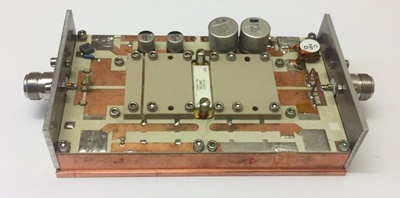
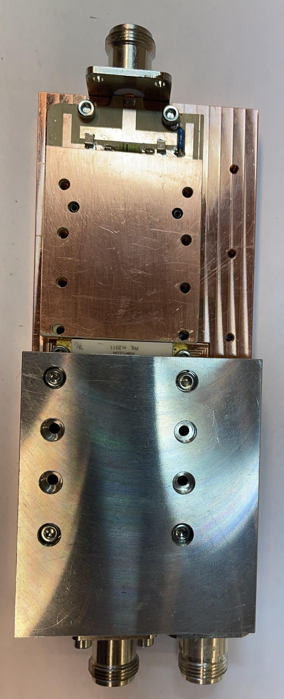
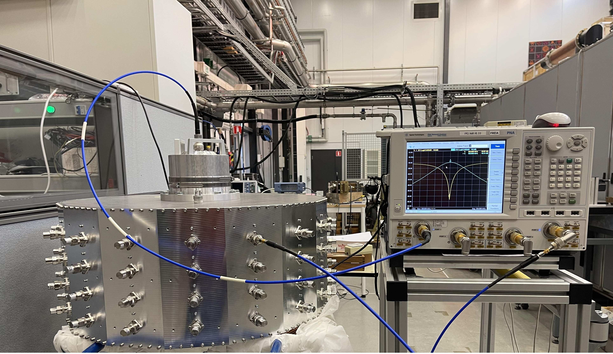

Alireza is a Microwave Engineer with almost a decade of experience in both academic and industrial settings. After earning Bachelor's and Master's degrees in Electronic Engineering in 2003 and 2006, respectively, he spent five years (2008-2013) as a Microwave Engineer at the highly-regarded Research Institute in Isfahan University of Technology, Iran, where he learned design and development of a vast range of microwave solid-state circuits, including power amplifiers, splitters, combiners, couplers, filters, switches, and DC bias circuits. 
 
In 2013, Alireza continued his education and research as a Ph.D. candidate at the University of Science and Technology Beijing in China. His thesis, entitled "Research on RF/Microwave High-Efficiency and Broadband Solid State Power Amplifier for Wireless Communications," earned him recognition as an outstanding international student upon graduation in 2017. Following his Ph.D., Alireza returned to the research institute in his home country as an Assistant Professor. 

He then applied for and was awarded grants from both the Marie Skłodowska-Curie Action of the European Union and Vinnova (Swedish government agency) in 2020. In September 2021, Alireza joined Uppsala University as a Marie Curie Postdoctoral Fellow with a high-scoring (99.4/100) proposal entitled "Implementation of Best Practices in Designing Solid State Power Amplifiers for Developing New Generation PET Accelerators". Currently, Alireza conducts research on several microwave circuits in different frequency ranges between 100MHz to 12GHz, including high-power solid-state amplifiers, splitters, and combiners at the FERIA Laboratory in Uppsala, Sweden.

<h1> Design and Development Experiences</h1>
<h2> Uppsala University</h2>

<table style="border:hidden;cellspacing=0; cellpadding=0;">

<!--1 *************************************************** -->
  
<tr>
    <td style = ""></td>
    <td> 

In this work, 

 </td>
  </tr>
<!--2 *************************************************** -->
 <tr>
    <td style = ""></td>
    <td>   
    

In this work, 

 </td>
  </tr>
<!--3 *************************************************** -->    
  
  <tr>
    <td style = ""></td>
    <td>   
    

In this work, 

 </td>
  </tr>
<!--4 *************************************************** -->    
  
  <tr>
    <td style = ""></td>
    <td>   
    

In this work, 

 </td>
  </tr>
<!--5 *************************************************** -->    
  <tr>
    <td style = ""></td>
    <td>   
    

In this work, 

 </td>
  </tr>
<!-- *************************************************** -->    
  
  </table>

<!-- *************************************************** -->

 <b>-2kW RF power amplifier using microstrip transmision lines</b>
 

<!-- *************************************************** -->

 <b>-1 To 64 ports 100kW power combiner</b>
 
<!img src="./imgs/Cavity_combiner.jpg" align="left" width="40%"/>
<!img src="./imgs/100kwcombinergif.gif" width = "29%"/>

 Cavity combiner
  

  
 
 
 
 
 
 
 
<h1> Contact</h1>

Mobil number: (+46)722883582 
Telephone number: (+46)-184713595 
Email1: alireza.kasaee@physics.uu.se 
Postal address: Box 516, 751 20 Uppsala, Sweden.  
Visiting address: Room No. 11627, Ångströmlaboratoriet, Lägerhyddsvägen 1.

