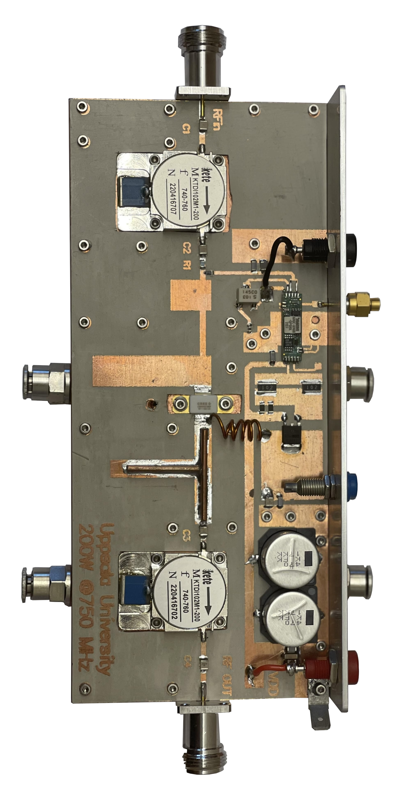
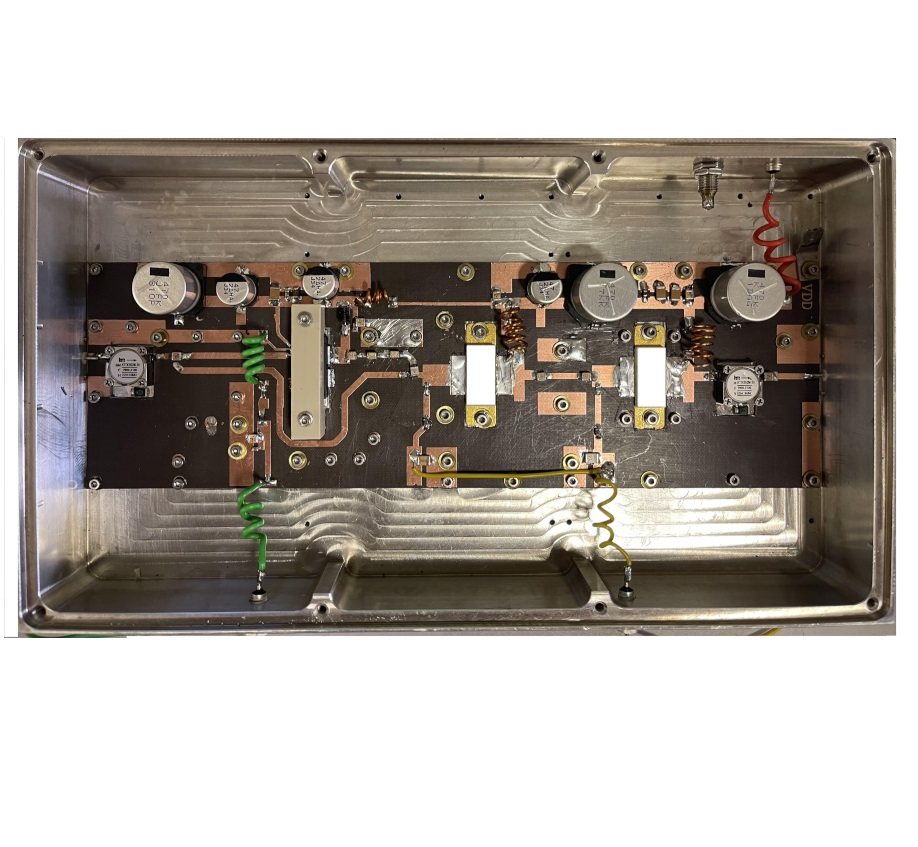

Alireza is a Microwave Engineer with almost a decade of experience in both academic and industrial settings. After earning Bachelor's and Master's degrees in Electronic Engineering in 2003 and 2006, respectively, he spent five years (2008-2013) as a Microwave Engineer at the highly-regarded Research Institute in Isfahan University of Technology, Iran, where he learned design and development of a vast range of microwave solid-state circuits, including power amplifiers, splitters, combiners, couplers, filters, switches, and DC bias circuits. 
 
In 2013, Alireza continued his education and research as a Ph.D. candidate at the University of Science and Technology Beijing in China. His thesis, entitled "Research on RF/Microwave High-Efficiency and Broadband Solid State Power Amplifier for Wireless Communications," earned him recognition as an outstanding international student upon graduation in 2017. Following his Ph.D., Alireza returned to the research institute in his home country as an Assistant Professor. 

He then applied for and was awarded grants from both the Marie Skłodowska-Curie Action of the European Union and Vinnova (Swedish government agency) in 2020. In September 2021, Alireza joined Uppsala University as a Marie Curie Postdoctoral Fellow with a high-scoring (99.4/100) proposal entitled "Implementation of Best Practices in Designing Solid State Power Amplifiers for Developing New Generation PET Accelerators". Currently, Alireza conducts research on several microwave circuits in different frequency ranges between 100MHz to 12GHz, including high-power solid-state amplifiers, splitters, and combiners at the FERIA Laboratory in Uppsala, Sweden.

<h1> Design and Development Experiences</h1>
<h2> Experiences in Uppsala University</h2>
<table>
<body>  
 <!--1 400kw************************************* -->
 <tr>
    <td></td>
    <td> 
 The Solid-state 400 kW RF power station comprises four 100-kW power amplifier racks, which are combined through a very low-loss cavity combiner to achieve an output power of 100 kW using 64 2-kW RF power amplifiers.The output line is equipped with an isolator to safeguard the station from reflection power. The input side of the station features a 1-to-64 in-phase cavity splitter that efficiently divides the signal across the amplifiers. With the provision of isolation between all amplifier units, the station is expected to function reliably.
    

    </td>
</tr>
<!--2 2kwmicrostrip************************************* -->
 <tr>
    <td></td>
    <td> 
 This design aims to utilize a pull-pull transistor to achieve a compact continuous wave 2kW RF solid-state power amplifier with a signal gain of 16 dB and up to 80% drain efficiency at 352MHz, making it suitable for use in high-power RF stations. The matching network in this design is based on a strip line configuration and does not utilize a bulun, enabling the amplifier to have very high efficiency. The PA has mechanical dimensions of 90mm x 160mm x 50mm.
    

    </td>
</tr>
<!--3 2kwstripline************************************ -->
 <tr>
    <td></td>
    <td>   
 The current design uses the same transistor as the previous one, but the innovation lies in implementing strip line transmission lines for the input and output matching networks. This results in a significantly more compact power amplifier, achieving 2kW output power, 16 dB signal gain, and up to 80% Drain efficiency. The transistor is biased in Class-C operation mode, providing high efficiency and eliminating the need for an RF DC bias circuit. However, due to its non-linear behavior, a linearizer is necessary for applications that require linearity performance. The PA has mechanical dimensions of 90mm x 160mm x 25mm. 
 </td>
 </tr>
<!--4 Cavity_splitter********************************** -->    
 <tr>
    <td></td>
    <td>   
 Various techniques and approaches exist for dividing RF signals, but for applications requiring high power, multiple medium power amplifiers must be utilized, necessitating the use of a low loss splitter. The spatial cavity splitting method is highly sought after due to its ability to not only provide low loss division but also occupy minimal space. A 1 to 64 RF spatial splitter utilizing this design has been created, which only incurs a 0.2 dB signal loss and has mechanical dimensions of 90mm x 50mm x 10mm. 
 </td>
 </tr>
<!--4 Cavity_Combiner************************************** -->    
  <tr> 
    <td></td>
    <td>  
 The RF signal combination process is a crucial stage in the design of high power stations, particularly for 100 kW power combiners. It is essential to minimize the incident power loss in order to prevent excessive heating, which can reduce the system efficiency. When combining 64 medium power amplifiers, a cavity combiner configuration is the optimal choice as it provides the lowest power loss. This method also requires very little space in comparison to other methods such as Binary, Wilkinson, or Gysel. The designed combiner exhibits an impressively low power loss of only 0.17 dB, which is a testament to its efficiency. Additionally, the combiner was designed with cost-effectiveness and compactness in mind at 352MHz, measuring only 90mm x 50mm x 10mm in size. 
 </td>
  </tr>
<!--5 Coaxial4to1combiner*************************************************** -->    
  <tr> 
    <td></td>
    <td>   
 The Wilkinson approach is a commonly used RF combination method that is often implemented in substrates because of its ability to handle non-50 ohm transmission lines and provide high-accuracy transition connections. One of the main advantages of this approach is its ability to exhibit high port-to-port isolation, which is not always achievable with other methods such as radial combiners and spatial combiners.
To achieve this, a coaxial Wilkinson combiner has been designed and developed, capable of handling continuous wave signals of up to 4 kW and pulsed RF signals of up to 20 kW. This combiner has been designed to provide at least 20 dB port-to-port isolation with a maximum RF power loss of 0.5 dB at 3562MHz, excluding a 6 dB reduction. Additionally, the designed coaxial Wilkinson combiner is capable of covering a wideband frequency bandwidth of more than 20% above 352 MHz. This feature makes it suitable for use in various applications that require a wide frequency range. 
 </td>
  </tr>
<!-- *************************************************** -->  
<!--6 Transition*************************************************** -->    
  <tr> 
    <td></td>
    <td>   
 Matching networks and transitions play a crucial role in RF power systems as they enable the signal to pass from one type of transmission line to another, minimizing the risk of reflection. The efficiency of the system is dependent on the minimum insertion power loss that occurs during this transition. Therefore, it is essential to have low-loss transitions to ensure optimal power efficiency. To address this issue, a compact and efficient transition for a 7/16 connector to a 6-1/8 connector has been designed and developed. The transition is only 10 cm in height, despite the wavelength of the 352 MHz signal being 85 cm in air. This design ensures minimal signal reflection and power loss. 
 </td>
  </tr>
<!-- *************************************************** -->  
 <!--7 200w 750MHz GaN amplifier*************************************************** -->    
  <tr> 
    <td></td>
    <td>   
 This design showcases the development and simulation of a Gallium Nitride (GaN) semiconductor-based power amplifier that operates at 750 MHz and delivers a continuous wave power of 200W with high efficiency. To achieve this, the transistor is biased in deep Class-AB (very close to class-B) mode, which enhances its efficiency. Additionally, load pull technique is employed to optimize the input and output impedances while employing 1st and 2nd order microstrip Chebyshev filters for the output and input matching networks, respectively. The resultant amplifier is able to deliver a remarkable slightly more than 200W with 85.5% drain efficiency at the operating frequency of 750 MHz.
 </td>
  </tr>
<!-- *************************************************** -->  
<!--7 1w 750MHz GaN amplifier*************************************************** -->    
  <tr> 
    <td></td>
    <td>   
 Six 200-watt GaN solid-state amplifiers are combined using a 1:6:1 high-power combiner/splitter to generate a total output power of 1 kilowatt, as discussed in the previous column. A low-loss combiner/splitter is designed and utilized for this purpose. The high-power amplifiers are expected to exhibit a power efficiency of over 80%. To achieve a compact size and due to the high efficiency performance of the power amplifier, a small heatsink is selected for the high-power amplifier. Although this heatsink can only dissipate up to 100 watts of power, it is equipped with water tubes to enable the dissipation of higher power up to 250 watts in continuous wave (CW) operation. 
 </td>
  </tr>
<!-- *************************************************** -->  
<!--8 500W 3GHz*************************************************** -->    
  <tr> 
    <td></td>
    <td>   
 Three RF power amplifiers were designed and developed to achieve a compact design with a 35 dB gain and output power of 500 watts. The amplifiers were simulated using the load pull utility provided in ADS, and most of the matching networks were implemented using the stepped impedance method. The substrate used for the amplifiers was Taconic RF-30 due to its thermal stability performance and low thermal dissipation factor. The PA has mechanical dimensions of 90mm x 160mm x 25mm. 
 </td>
  </tr>
<!-- *************************************************** -->  
  </body>
  </table>

  
 
<h1> Contact</h1>

Mobil number: (+46)722883582 
Telephone number: (+46)-184713595 
Email1: alireza.kasaee@physics.uu.se 
Postal address: Box 516, 751 20 Uppsala, Sweden.  
Visiting address: Room No. 11627, Ångströmlaboratoriet, Lägerhyddsvägen 1.

