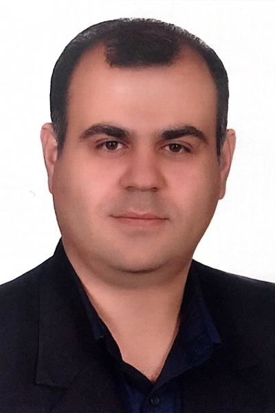

Alireza is a Microwave Engineer with almost a decade of experience in both academic and industrial settings. After earning Bachelor's and Master's degrees in Electronic Engineering in 2003 and 2006, respectively, he spent five years (2008-2013) as a Microwave Engineer at the highly-regarded Research Institute in Isfahan University of Technology, Iran, where he learned design and development of a vast range of microwave solid-state circuits, including power amplifiers, splitters, combiners, couplers, filters, switches, and DC bias circuits. 
 
In 2013, Alireza continued his education and research as a Ph.D. candidate at the University of Science and Technology Beijing in China. His thesis, entitled "Research on RF/Microwave High-Efficiency and Broadband Solid State Power Amplifier for Wireless Communications," earned him recognition as an outstanding international student upon graduation in 2017. Following his Ph.D., Alireza returned to the research institute in his home country as an Assistant Professor. 

He then applied for and was awarded grants from both the Marie Skłodowska-Curie Action of the European Union and Vinnova (Swedish government agency) in 2020. In September 2021, Alireza joined Uppsala University as a Marie Curie Postdoctoral Fellow with a high-scoring (99.4/100) proposal entitled "Implementation of Best Practices in Designing Solid State Power Amplifiers for Developing New Generation PET Accelerators". Currently, Alireza conducts research on several microwave circuits in different frequency ranges between 100MHz to 12GHz, including high-power solid-state amplifiers, splitters, and combiners at the FERIA Laboratory in Uppsala, Sweden.

<h1> Design and Development Experiences</h1>
<h2> Uppsala University</h2>

| Picture | Description |
| --- | --- |
| ![2kwmicrostrip] | 
 The Solid-state 400 kW RF power station comprises four 100-kW power amplifier racks, which are combined through a very low-loss cavity combiner to achieve an output power of 100 kW using 64 2-kW RF power amplifiers.The output line is equipped with an isolator to safeguard the station from reflection power. The input side of the station features a 1-to-64 in-phase cavity splitter that efficiently divides the signal across the amplifiers. With the provision of isolation between all amplifier units, the station is expected to function reliably.|
| ![2kwstripline] | 
This design aims to utilize a pull-pull transistor to achieve a compact continuous wave 2kW RF solid-state power amplifier with a signal gain of 16 dB and up to 80% drain efficiency at 352MHz, making it suitable for use in high-power RF stations. The matching network in this design is based on a strip line configuration and does not utilize a bulun, enabling the amplifier to have very high efficiency. The PA has mechanical dimensions of 90mm x 160mm x 50mm.|
| ![1To64splitter] | 
The current design uses the same transistor as the previous one, but the innovation lies in implementing strip line transmission lines for the input and output matching networks. This results in a significantly more compact power amplifier, achieving 2kW output power, 16 dB signal gain, and up to 80% Drain efficiency. The transistor is biased in Class-C operation mode, providing high efficiency and eliminating the need for an RF DC bias circuit. However, due to its non-linear behavior, a linearizer is necessary for applications that require linearity performance. The PA has mechanical dimensions of 90mm x 160mm x 50mm.|

  
 
<h1> Contact</h1>

Mobil number: (+46)722883582 
Telephone number: (+46)-184713595 
Email1: alireza.kasaee@physics.uu.se 
Postal address: Box 516, 751 20 Uppsala, Sweden.  
Visiting address: Room No. 11627, Ångströmlaboratoriet, Lägerhyddsvägen 1.

